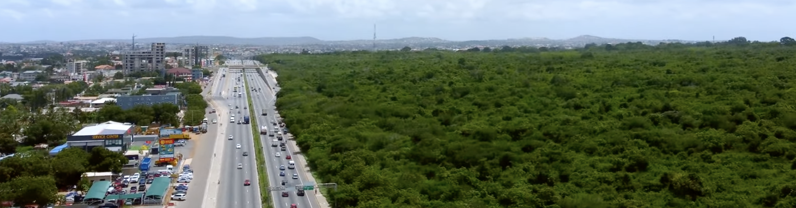
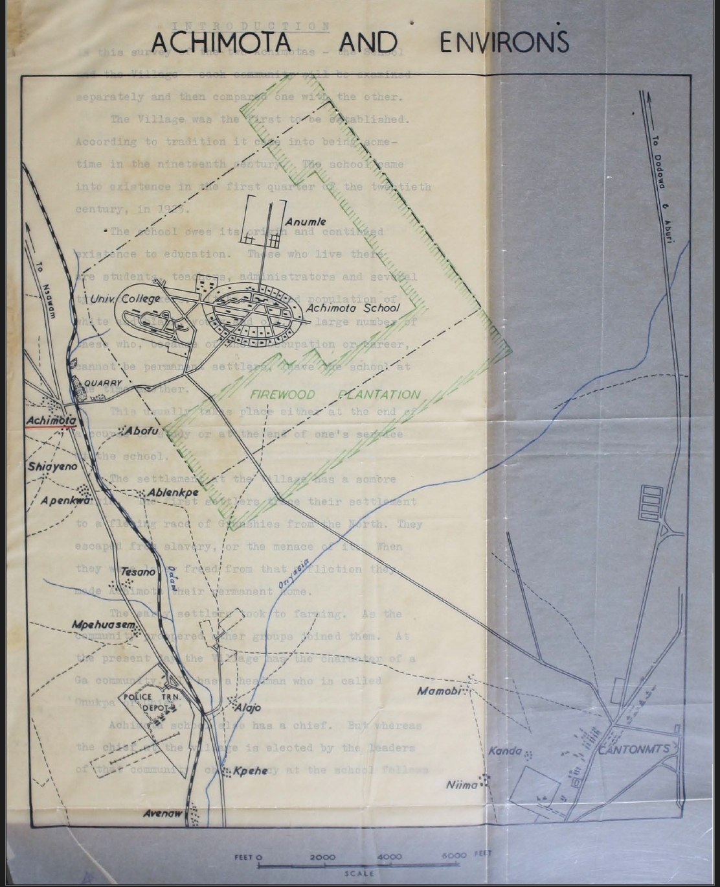

Achimota Forest Reserve should be understood through the longer legal sequence that made colonial reserve-making possible in the Gold Coast. The Public Lands Ordinance of 1876 gave the government a framework for acquiring land for public purposes. The Crown Lands Bills of 1894 and 1897 revealed the colonial desire to classify certain lands as vacant, waste, or available for state use. The Concessions Ordinance of 1900 made land and natural resources more legible through formal legal instruments, while Native Jurisdiction and Native Administration laws brought chiefs and Native Authorities into the work of forest by-laws and indirect rule. By the time the Forest Ordinance of 1927 was passed, the colonial state had assembled the legal machinery needed to acquire, classify, patrol, and regulate forests. Achimota emerged from this layered legal world, but its significance goes beyond law alone.

The transformation of Achimota into a firewood plantation and forest reserve was part of a broader colonial improvement logic. Officials did not treat the land simply as forest to be preserved in its natural state. They saw it as a peri-urban landscape that could be redesigned to serve the needs of a growing colonial capital. Accra’s population was increasing, sanitation remained a major concern after the bubonic plague of 1908, and colonial planners were attracted to the idea of green buffers, open space, and healthier institutional environments. Thus, Achimota’s distance from central Accra became valuable. It was close enough to serve the city and the Prince of Wales College, but far enough to be imagined as a cleaner, greener, and more orderly alternative to the congested urban core. [Interactive Achimota Map](#achimota-map)




This improvement logic also drew from wider imperial conservation and **Garden City** thinking form the metropole. After the Empire Forestry Conferences of the 1920s, colonial forestry increasingly emphasized reserve-making, scientific management, erosion control, fuel supply, and the protection of watersheds and urban environments. At Achimota, these concerns converged with educational planning. The forest reserve, firewood plantation, school grounds, gardens, nurseries, roads, and later recreational spaces were not separate projects. They formed one hybrid landscape in which conservation, sanitation, elite education, and colonial prestige worked together. The reserve supplied firewood for Achimota School and Accra, protected the school environment, created a green edge for the expanding city, and demonstrated how land could be made productive, healthy, and governable.

Yet Achimota was not an empty landscape waiting for colonial improvement. Its suitability for this project depended in part on its older local meanings. Within Ga spatial thought, Achimota stood as a frontier north of Accra’s political and ritual center. It was socially marginal but not meaningless. Oral traditions connected the area to migrant settlement, freed persons, tribute relations, Ga custodianship, and the sacred presence of the Atjimota deity. Its marginality made it available to strangers, farmers, and displaced people under negotiated conditions, while its sacredness marked it as a space of spiritual caution and local authority. Colonial officials simplified this complex landscape by describing it in terms such as scrub, uncultivated land, or available public land, but those descriptions obscured the layered social and ritual world that already existed there.

This history therefore reveals the hybridity of colonial reserve-making. The reserve was created through colonial law, but it gained its particular form through the meeting of several forces: local Ga meanings of frontier land, colonial legal acquisition, Garden City planning, public health concerns, forestry science, and the educational ambitions of the colonial state. Its marginality was central to this process. Precisely because Achimota stood at the edge of Accra’s valued urban and ritual spaces, colonial officials could recast it as a model improvement landscape. The result was neither a purely local sacred frontier nor a purely colonial forest reserve, but a hybrid space where older meanings of land were overlaid by new regimes of law, conservation, sanitation, education, and urban order.


#### Interactive Achimota Map {#achimota-map}

```{r}
#| echo: false
#| warning: false
#| message: false

library(leaflet)
library(leaflet.extras)
library(dplyr)
library(readr)
library(htmltools)

# Main Achimota Forest center from your earlier mapping work
achimota_center <- data.frame(
  name = "Achimota Forest Reserve approximate centre",
  longitude = -0.201111,
  latitude = 5.624722,
  area_ha = 432,
  radius_m = sqrt((432 * 10000) / pi)
)

# Internal Achimota indicators
# IMPORTANT: These coordinates are approximate placeholders.
# Replace them later with GPS readings, official shapefiles, or carefully georeferenced historical maps.
achimota_internal <- tibble::tribble(
  ~place_name, ~place_type, ~longitude, ~latitude, ~date_label, ~period, ~color, ~icon_name, ~popup_note,

  "Achimota School",
  "Educational / colonial institutional space",
  -0.2050, 5.6300,
  "1925",
  "Colonial",
  "blue",
  "education",
  "Achimota School came into existence in 1925. It became the Prince of Wales School and College in 1925 and later developed as a major institutional landscape tied to colonial education, planning, and environmental ordering.",

  "Achimota Golf Course",
  "Recreational / elite landscape",
  -0.2120, 5.6285,
  "Shown on Achimota School plan; exact date needs verification",
  "Colonial / postcolonial",
  "green",
  "flag",
  "The local survey’s plan of Achimota School includes a golf course. This marks the forest-school landscape as not only educational but also recreational and elite in character.",

  "GIMPA",
  "Postcolonial administrative / training institution",
  -0.2135, 5.6265,
  "Post-1957; 1961",
  "Postcolonial",
  "purple",
  "briefcase",
  "GIMPA represents the later postcolonial reuse of the Achimota green/institutional zone for public administration, professional training, and state capacity-building.",

  "Prayer Camp",
  "Religious / healing landscape",
  -0.1985, 5.6275,
  "Date unknown; verify through oral history or fieldwork",
  "Postcolonial / ongoing",
  "orange",
  "heart",
  "The prayer camp shows the continuing religious and therapeutic use of Achimota’s green space. It should be mapped as part of the living religious geography of the forest, not merely as an encroachment.",

  "Sacred abode of the Adjimota deity",
  "Sacred / spiritual landscape",
  -0.1945, 5.6225,
  "Precolonial or nineteenth-century oral tradition; exact date unknown",
  "Long durée",
  "red",
  "star",
  "This marks the remembered sacred abode associated with the Adjimota deity or powerful local spiritual presence. This coordinate provisional. It should be verified through oral sources and handled respectfully."
)

# Popup content
achimota_internal <- achimota_internal %>%
  mutate(
    popup_text = paste0(
      "<div style='font-family: Arial; max-width: 280px;'>",
      "<h3 style='margin-bottom:4px;'>", place_name, "</h3>",
      "<b>Type:</b> ", place_type, "<br>",
      "<b>Date:</b> ", date_label, "<br>",
      "<b>Period:</b> ", period, "<br><br>",
      "<b>Historical note:</b><br>", popup_note,
      "<br><br><i>Coordinate status: provisional / needs field verification.</i>",
      "</div>"
    )
  )

# Icons for each internal space
internal_icons <- awesomeIcons(
  icon = achimota_internal$icon_name,
  markerColor = achimota_internal$color,
  library = "fa",
  iconColor = "white"
)

# Main map
leaflet() %>%

  # Base maps
  addProviderTiles(
    providers$OpenStreetMap,
    group = "OpenStreetMap"
  ) %>%
  addProviderTiles(
    providers$Esri.WorldImagery,
    group = "Satellite"
  ) %>%
  addProviderTiles(
    providers$CartoDB.Positron,
    group = "Light base map"
  ) %>%

  # Approximate Achimota Forest footprint
  addCircles(
    data = achimota_center,
    lng = ~longitude,
    lat = ~latitude,
    radius = ~radius_m,
    color = "darkgreen",
    weight = 2,
    fillColor = "forestgreen",
    fillOpacity = 0.22,
    popup = ~paste0(
      "<b>", name, "</b><br>",
      "Approximate area: ", area_ha, " hectares<br>",
      "Approximate radius: ", round(radius_m, 0), " metres<br>",
      "This is an analytical circle, not an official boundary."
    ),
    group = "Approximate Achimota Forest footprint"
  ) %>%

  # Forest center point
  addCircleMarkers(
    data = achimota_center,
    lng = ~longitude,
    lat = ~latitude,
    radius = 6,
    color = "darkgreen",
    fillColor = "white",
    fillOpacity = 1,
    weight = 2,
    popup = ~paste0(
      "<b>", name, "</b><br>",
      "Coordinate: 5.624722, -0.201111"
    ),
    group = "Forest centre"
  ) %>%

  # Internal Achimota markers
  addAwesomeMarkers(
    data = achimota_internal,
    lng = ~longitude,
    lat = ~latitude,
    icon = internal_icons,
    popup = ~popup_text,
    label = ~paste0(place_name, " (", date_label, ")"),
    group = "Internal Achimota spaces"
  ) %>%

  # Permanent labels beside the markers
  addLabelOnlyMarkers(
    data = achimota_internal,
    lng = ~longitude,
    lat = ~latitude,
    label = ~place_name,
    labelOptions = labelOptions(
      noHide = TRUE,
      direction = "right",
      textOnly = TRUE,
      textsize = "13px",
      style = list(
        "font-weight" = "bold",
        "color" = "black",
        "background-color" = "rgba(255,255,255,0.75)",
        "padding" = "2px"
      )
    ),
    group = "Labels"
  ) %>%

  # Legend
  addLegend(
    position = "bottomright",
    colors = c("blue", "green", "purple", "orange", "red", "darkgreen"),
    labels = c(
      "School / education",
      "Golf course / recreation",
      "GIMPA / public administration",
      "Prayer camp / religion-healing",
      "Sacred abode / deity",
      "Approx. forest footprint"
    ),
    title = "Achimota Landscape Layers"
  ) %>%

  # Tools
  addMiniMap(
    tiles = providers$OpenStreetMap,
    toggleDisplay = TRUE
  ) %>%
  addMeasure(
    position = "topleft",
    primaryLengthUnit = "kilometers",
    secondaryLengthUnit = "meters",
    primaryAreaUnit = "hectares",
    secondaryAreaUnit = "sqmeters"
  ) %>%
  addScaleBar(
    position = "bottomleft"
  ) %>%

  # Layer controls
  addLayersControl(
    baseGroups = c(
      "OpenStreetMap",
      "Satellite",
      "Light base map"
    ),
    overlayGroups = c(
      "Approximate Achimota Forest footprint",
      "Forest centre",
      "Internal Achimota spaces",
      "Labels"
    ),
    options = layersControlOptions(collapsed = FALSE)
  ) %>%

  # Start view around Achimota
  setView(
    lng = -0.201111,
    lat = 5.624722,
    zoom = 14
  )
```


