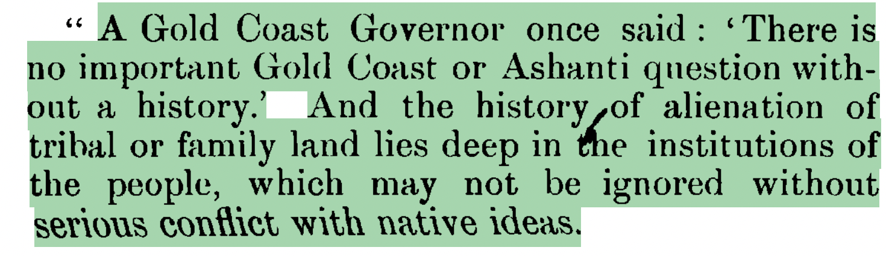

On May 6, 1911, J. E. Casely Hayford, leader of the Aborigines Rights Protection Society (ARPS), published a newspaper article “The Gold Coast an El Dorado — A Glorious Prospect and a Warning”, among other means, to challenge two related threats to African landholding in the Gold Coast: the alienation of communal lands through long-term mining concessions to foreign companies, and the colonial government’s repeated attempt to bring African forests under centralized legal control. Their criticism belonged to a longer struggle over land and forest legislation, beginning with the Public Lands Ordinance of 1876, the Crown Lands Bills of 1894 and 1897, the Concessions Ordinance of 1900, the Forest Bill of 1911, and later the Forest Ordinance of 1927, alongside Native Jurisdiction, Native Administration, and Supreme Court frameworks that shaped questions of land title, chiefly authority, compensation, and legal jurisdiction. Casely Hayford and his contemporaries feared that these measures would gradually weaken local control over land, forests, and natural resources by transferring authority from stools, families, chiefs, and communities to the colonial state. In their view, such a process threatened to turn Africans into landless people in their own country, while foreign investors and colonial officials profited from resources that had long been embedded in communal rights, customary authority, and local livelihood.

Achimota offers a powerful example of how these legislative struggles later materialized in a specific landscape. The creation of the Achimota Firewood Plantation and Forest Reserve followed the legal pathway opened by earlier land and forest ordinances, especially the Public Lands Ordinance of 1876 and the Forest Ordinance of 1927. Yet Achimota was more than a legal product of colonial reserve-making. It became a model of colonial improvement: a landscape redesigned to serve education, forestry, sanitation, fuel supply, and urban planning at the edge of a growing Accra. This case speaks to earlier works such as Roderick Neumann’s and Terence Ranger’s studies of African environments, which show how colonial conservation often reclassified African landscapes as natural resources requiring state control. Achimota extends that argument with an important twist. The land was not simply misread as empty or unused. It was already a socially marginal but locally meaningful Ga frontier, associated with sacred presence, negotiated settlement, migrant farming, and limited agrarian value. Its marginality made it attractive to colonial planners, while its sacred and social meanings show that colonial improvement worked by overlaying new legal and environmental categories onto landscapes that already carried local histories.
