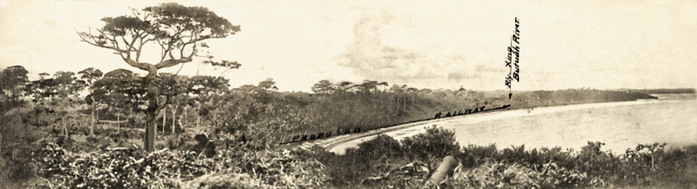

{#fig-ordinance}

## Background

This website is an off-shoot of my MA Portfolio project , **“Land, Law, and Colonial Improvement in the Gold Coast: African Responses and the Making of Achimota, 1884-1950,”** I trace a history of resisitance that were multifaceted and specifical environmental and how that long history led to the creation of forest reserves such as Achimota Forest Reserve in Accra, Ghana. 
Achimota Forest Reserve emerged from a longer colonial legal history in which land and forest ordinances turned African landscapes into objects of survey, acquisition, regulation, and planned improvement. From the Public Lands Ordinance of 1876 through the Forest Bill and the Forest Ordinance of 1927, colonial officials built a legal framework for converting land into reserves, plantations, institutional grounds, and protected green spaces. Achimota became one of the clearest examples of this process. In 1922, George Owoo, representative of the Owoo family ceded the Achimota lands in acknowledgement of colonial purchase under the Public Lands Ordinance. The space was immediately drawn into a wider project that joined the Prince of Wales College, the Achimota Firewood Plantation, and the Achimota Forest Reserve into one planned colonial landscape. 

The argument is that Achimota became a model of colonial improvement because it brought together projects the colonial state might otherwise have pursued separately: forest conservation, firewood supply, sanitary planning, elite education, and controlled urban expansion under the Garden City movement. Its creation responded to Accra’s growing population, anxieties over disease and sanitation after the 1908 bubonic plague, metropolitan conservation thinking after the Empire Forestry Conferences of the 1920s, and African demands for higher education in the Gold Coast. Yet Achimota was suitable for colonial redesign precisely because it already occupied a distinctive place in Ga spatial thought. It was a wooded frontier 8 miles north of Accra, socially marginal yet ritually charged, associated with sacred presence, negotiated settlement, migrant farmers, and Ga custodianship. Colonial officials therefore did not create meaning on empty land. They overlaid new legal, educational, sanitary, and forestry regimes onto a landscape already shaped by local authority, sacred power, and social memory.See @fig-ordinance. 

## Colonial Ordinances

### Bond of 1844
1844

Customary land authority remained dominant, though British legal hegemony and presence expanded along the coastal towns. this was undoubtedly the beginning of a long history of legislative instruments, drafted, protested against, co-opted and eventually passed but in line with colonial objective of land control.

### The Supreme Court Ordinance and Public Lands Ordinance
1876: [link to the 1876 ordinance](public-lands-1876.qmd)

The re-enactment of the Supreme COurt Ordinnance in the Gold Coast did not only redefine the hurisdiction of English COmmon Law but also the introduction of Bristish ideas and conceptions of land administration that vested all *waste lands* as Crown owned through the **The Public Land Ordinance**.

year: "1894",
title: "Crown Lands Bill",
text: "Attempted classification of lands as available for Crown control, challenging customary tenure."

year: "1911",
title: "Forestry Bill",
text: "Proposed expanded state control over forests and timber."

year: "1927",
title: "Forestry Ordinance",
text: "Formalized reserve creation and restricted local land use."

